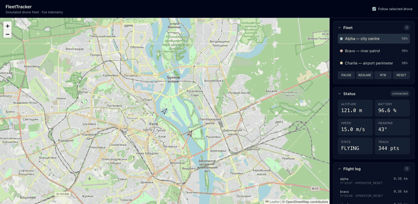
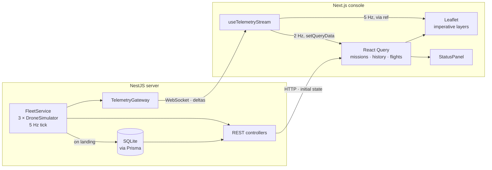

# FleetTracker

[](https://github.com/markolagunets-dotcom/fleet-tracker/actions/workflows/ci.yml)

A real-time drone fleet console. A NestJS service simulates three drones flying
waypoint missions and streams their telemetry over WebSocket; a Next.js frontend
renders live tracks on Leaflet with a status panel, operator commands, and a
persisted flight log.



## Architecture



## Running it

```bash
npm install
npm run build -w @fleet-tracker/shared
cd apps/server && npx prisma migrate dev --name init && cd ../..
npm run dev
```

- Console: http://localhost:3000
- API docs (Swagger): http://localhost:3001/api/docs

Or with Docker:

```bash
docker compose up --build
```

## Design decisions

**REST for initial state, WebSocket for deltas.** A connecting client fetches the
planned missions and the track flown so far over HTTP, then subscribes to the socket
for subsequent points. Folding the snapshot into the socket as a `history` frame
would have been fewer moving parts, but it makes that payload uncacheable, untestable
with `supertest`, and invisible to anything that speaks HTTP. Each transport does
what it is good at.

**Raw Leaflet, not react-leaflet.** At 5 Hz across three drones with tracks up to
2000 points each, the declarative wrapper would re-render and hand Leaflet a fresh
copy of every point array fifteen times a second. Instead the map, markers and
polylines live in refs, and each frame calls `marker.setLatLng()` and
`polyline.addLatLng()`. React never re-renders on telemetry.

**React Query owns cold data only.** Missions, track history and the flight log are
queries. Live points deliberately bypass the cache — only a throttled snapshot is
written with `setQueryData` at 2 Hz, for the status panel, the one consumer that
actually needs a re-render. Knowing where a data-fetching library helps and where it
gets in the way mattered more here than using it everywhere.

**Native `ws`, not Socket.IO.** The browser's built-in `WebSocket` needs no client
library, the frames are readable in DevTools, and none of Socket.IO's features
(rooms, acks, long-polling fallback) are used. Reconnection with exponential backoff
is about twenty lines.

**One tick frame for the whole fleet.** The gateway batches all three drones into a
single `tick` message. At 5 Hz that is 5 frames per second rather than 15, and the
client always renders a coherent fleet state instead of three interleaved partial
updates.

**A shared contract package, kept narrow.** `@fleet-tracker/shared` holds the wire
types, a `parseServerMessage()` guard and the two constants both ends must agree on —
and nothing else. The flight model stays on the server, missions are served over
`/api/missions` rather than duplicated, and client pacing lives in the web app.
Change a field on the server and the frontend typecheck fails in CI, which is the
whole point of putting the contract in one place; putting anything wider there would
just ship simulation internals to the browser.

**Dependencies point inward.** The simulation depends on a `FlightArchive` port, not
on the Prisma repository that implements it, and raises domain errors that a filter
maps to HTTP at the edge. Nothing in the core imports a database or a transport type.
Responsibilities are split accordingly: `TrackStore` buffers, `FlightArchiver`
persists, `TelemetryScheduler` owns the interval, `FleetService` coordinates.

**The wire format is versioned.** The server and the console ship as separate images,
so a tab open across a release can be a version behind. The client sends
`PROTOCOL_VERSION` on the handshake, the gateway refuses a mismatch with close code
1008, and the console offers a reload instead of reconnecting into the same refusal.
A silent mis-render is a far worse failure than an explicit one.

**The simulation core is pure.** `geo.ts`, `drone-simulator.ts` and
`flight-summary.ts` have no Nest, no I/O and no clock access — every time value is a
parameter. That is what lets the flight model be tested with plain assertions and no
fake timers.

**Track points are written in one batch when a flight ends**, not per tick. Writing
15 rows a second would make SQLite the bottleneck of a system that is otherwise not
I/O bound.

## Testing

```bash
npm test           # 53 unit tests: geodesy, flight model, fleet coordination,
                   # the wire contract, and the environment schema
npm run test:e2e   # 14 e2e tests: REST endpoints and persistence, via supertest
```

The frontend has no unit tests. At this size the rendering path is verified faster
and more honestly in a browser, and claiming coverage that does not exist would be
worse than saying so.

## Known limitations

- Simulation state lives in one process, so the server does not scale horizontally.
- SQLite fits a single-node demo; production would want Postgres, and a time-series
  store for track points.
- There is no authentication — the console assumes a single trusted operator.

## Layout

```
apps/server      NestJS: simulation, REST API, WebSocket gateway, Prisma
apps/web         Next.js: App Router console, React Query, Leaflet
packages/shared  wire contract, constants, mission definitions
docs/design.md   the design this was built from
```
